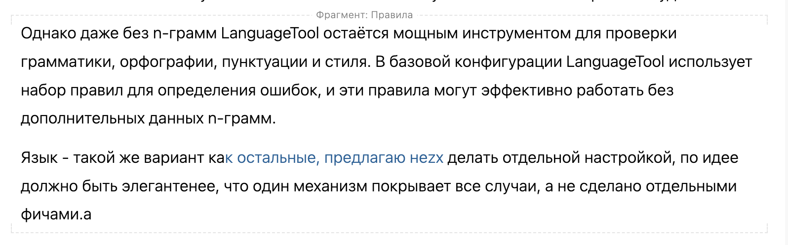

:::note чего пока нет

-  Терминология пока используется смешанная, надо решить какую тут выбрать.

-  Предлагаю пока реализовать только фрагменты на уровне статей. Потом по этой же механике добавим разделы статьи.

:::

### Основной сценарий

Редактор создает мастер-фрагмент и переиспользует его в других статьях чтобы избежать дублирования:

-  **Тулбар статьи**. Переходит в статью, которую хочет переиспользовать. Курсор автоматически встает в заголовок статьи -- в нижнем тулбаре показываются только: 1) инпут с названием файла с заполненным названием 2) вжимаемый признак фрагмента 3) свойства 4) корзинка удаления статьи.

-  **Пометка статьи как мастер-фрагмент**. Вжимает иконку фрагмента -- статья помечается мастер-фрагментом. В заголовке появляется символ решетки, по которому понятно, что эта статья мастер-фрагмент.

-  **Тулбар мастер-фрагмента**. Открывается второстепенный тулбар для работы с фрагментом с элементами: 1) Название фрагмента 2) [icon:magnifying-glass-arrow-right] *Найти использования* / *Find usages*

-  **Вставка фрагмента**. Переходит в другую статью. Вставляет посередине статьи пустой абзац и в нижнем тулбаре выбирает элемент [icon:frame] с тултипом *Вставить фрагмент*. Кнопка вжимается и во второй панели выше появляется панель вставки фрагмента (только элементы раскроются наверх, т.к. вниз некуда):

   

   В списке отображаются все фрагменты, которые есть в каталоге. Второй строкой отображается путь до статьи фрагмента. Выбирает нужный фрагмент и он вставляется в текст статьи.

-  **Просмотр фрагмента в статье**. Содержимое всего фрагмента отображается в статье и выделяется синей рамочкой как картинка. Отображается в режиме ридонли как изображение.

   Для выделенного фрагмента отображается второй тулбар: 1) [icon:frame] выбранная статья в виде ссылки + [icon:arrow-up-right] с тултипом *Перейти к мастер-фрагменту \[Enter\]* 3) [icon:trash] с тултипом *Удалить экземпляр фрагмента \[Del\]*.

-  **Переход к фрагменту и просмотр использований**. По нажатию на Enter или двойным кликом переходит к статье с мастер-фрагментом. Изменяет ее содержимое. В тулбаре фрагмента нажимает на элемент *Найти использования.* В выпадающем списке видит статью, в которую ранее был вставлен фрагмент. Кликает на нее, переходит к началу вставки и видит автоматически обновленное содержимое.

### Дополнительные требования

-  **При снятии отметки мастер-фрагмент проверять использования**. В тулбаре можно отжать кнопку мастер-фрагмента, чтобы снять возможность переиспользовать эту статью. При попытке снять проверяются использования фрагмента в статье и если есть, то отображается ошибка: Этот фрагмент используется в N статьях. Пожалуйста,  . По ссылкам можно перейти в статьи. Ниже кнопки 1) *Отменить* 2) *Все равно удалить*, в тултипе -- *Все ссылки на этот фрагмент в производных статьях станут невалидными*.

-  **Защита от рекурсии**. В мастер-фрагмент можно вставлять другие фрагменты, но проверять нет ли там циклической вставки. Если есть, то при попытке вставки выдавать ошибку: *Циклическая зависимость. Невозможно вставить фрагмент, который переиспользует прямо или опосредованно этот мастер-фрагмент*.

-  **Обновлять ссылки при перемещении фрагментов**. При переименованиях и любых перемещениях ссылки нужно обновлять так же как и в ресурсах, т.е. должен использоваться тот же механизм.

-  **Ошибка побитой ссылки**. Если каким-то образом все равно возникла побитая ссылка (например, при редактировании через markdown), то выводить стандартную ошибку рендера для блоков. В ошибке выводить статью (или путь к файлу если статьи уже нет).

-  **Побитые ссылки в проверках**. В проверки на ошибки для битого использования фрагментов добавить отдельную секцию. Секция необязательна, т.е. если нет ни одного фрагмента, то она не выводится.

## План

*Тут описать пожелания к порядку выполнения работы, что является более, а что менее важным. Основная цель, чтобы можно было не доделать, но все равно иметь работоспособный вариант.*

*Тут же предлагаю верхнеуровневый план по юзерсторям, можно в виде гантт-диаграммы с зависимостями и майлстоунами.*

## Открытые вопросы

-  **Решить насчет терминологии**. Возможно стоит сделать источник, но основной смысл который я хотел бы заложить -- компоненты. Можем их называть источниками. Я хотел бы чтобы мы опирались на фирму концептуально, там это называется все компоненты: есть экземпляр, а есть главный компонент (раньше назывался мастер-компонентом)

   Источник -- статья, в которой лежит фрагмент.

   -  Фрагмент -- блок текста, который переиспользуется.

   -  Производные статьи -- статьи, в которые включаются фрагменты.

[cut:оригинальный ответ от chatgpt:false]

1\. **Статья-донор**:\
• **Источник-шаблон** или **Основной источник**. Эти термины подчеркивают, что документ служит отправной точкой для содержания, которое будет переиспользовано в других местах.\
• В других системах могут использоваться термины, такие как **Master Document**, **Source Template**, или **Content Library** для обозначения документов или фрагментов, предназначенных для повторного использования.\
2\. **Фрагмент**:\
• **Переиспользуемый блок** или **Контентный блок**. Это названия отражают идею маленьких частей текста, которые можно вставлять в различные документы.\
• В системах управления контентом (CMS) и документацией часто применяются понятия\
**Snippet**, **Content Fragment**, или **Reusable Content Block**.\
3\. **Статья, в которую я вставляю этот фрагмент**:\
• **Целевой документ** или **Производный документ**. Эти термины помогают понять, что документ формируется с использованием информации, полученной из другого источника.\
• Аналогично, можно встретить названия вроде **Derived Document**, **Target Document**, или\
**Content Consumer** в различных системах документирования.

[/cut]

-  **Придумать иконку для фрагментов**. Пока предлагаю сделать frame, но хотелось бы что-то более отражающее суть. Может взять из фирмы ромбики, тут можно про это почитать <https://medium.com/@thien91dn/all-about-figma-component-properties-and-tips-769f1ffc7fd4>

-  **Как показать настройки статьи?** Тут есть постоянные признаки, а есть те, которые являются действиями и лучше, чтобы они появлялись только при наведении. Я предлагаю делать их серым, т.е. с прозрачностью 50%, при наведении на заголовок они чернеют (или синеют как активные элементы-действия, надо придумать как делать лучше).

   Важно что механика показа настроек для статьи и для разделов желательно чтобы была максимально одинакова.

   Потом возможно мы все настройки вытащим как в notion в меню по слешику.

   Можно сделать, чтобы было прижато к правому краю, но тогда троеточие надо всегда показывать, иначе будет прыгать, или же показывать слева от признака фрагмента.

   

   [cut:Дополнительные виды:false]

   Вид при наведении, либо чернеть, либо синеть, либо вид тулбара принимать:

   

   

   

   [/cut]

   Имхо, лучше по второму варианту, иконку фрейма показывать всегда, а троеточие только при наведении на заголовок. По троеточию показывается то же меню, которое у нас показывается в навигации для статьи.

-  **Убрать заголовок в свойствах статьи**. Из окна свойств статьи убрать заголовок статьи, сейчас он как будто там лишний.

-  **Строка системных свойств статьи**. У статьи есть системные свойства: например когда и кто создал ее или дата последнего изменения. Для этого можно под статьей добавить строку, которая отображается как в режиме просмотра, так и в редактировании.

-  **Скрытие заголовка вставки**. Опционально, можно в тулбар вставки добавить скрывать или показывать заголовок фрагмента.

-  **Как увидеть где начинается и заканчивается вставка?** Предлагаю сделать серую прямоугольную обводку. Но в первой версии можно пока этого не делать. Как понять где начинается и заканчивается вставленный фрагмент. НеГде вставленный фрагмент начинается и где заканчивается - надо это понимать…

-  **Вид фрагмента без заголовка**. Оставил чтобы не потерять, вдруг пригодится для чего:

   

-  **Как это будет выглядеть в маркдауне?** В мастер-фрагменте: в статье в frontmatter будет свойство fragment: true или название фрагмента для справочника фрагмента. При использовании будет маркдаун вида `` (или `fragment-include` или `include-fragment`?)

-  **Пока только на уровне статей**. Предлагаю пока реализовать фрагменты на уровне статей. Потом по этой же механике добавим возможность указать для разделов. Там будут такие сложности:

   -  надо будет понять где мастер-фрагмент будет начинаться и заканчиваться.

   -  решить можно ли вставить фрагмент в статью, где этот фрагмент объявлен? (думаю да)

   -  запретить чтобы внутри фрагмента нельзя было делать другие мастер-фрагменты

-  **Смещение уровней заголовка фрагмента**. В тулбар вставленного фрагмента можно добавить опцию, в которой указывать от какого уровня заголовка вставлять контент.

-  **Высокие вставки с клавиатуры перескакивать**. Если фрагмент слишком высокий и я хочу по нему пролистать с клавиатуры, то я не смогу это сделать, т.к. сам фрагмент ридонли. Т.е. будет прыг, надо это понять и принять.

### На будущее

-  **Будущая параметризация**. В будущем в переиспользование фрагмента добавим возможность сконфигурить параметры, как токены в фигме. Также у нас был где-то компонент формирования формы по JSON.