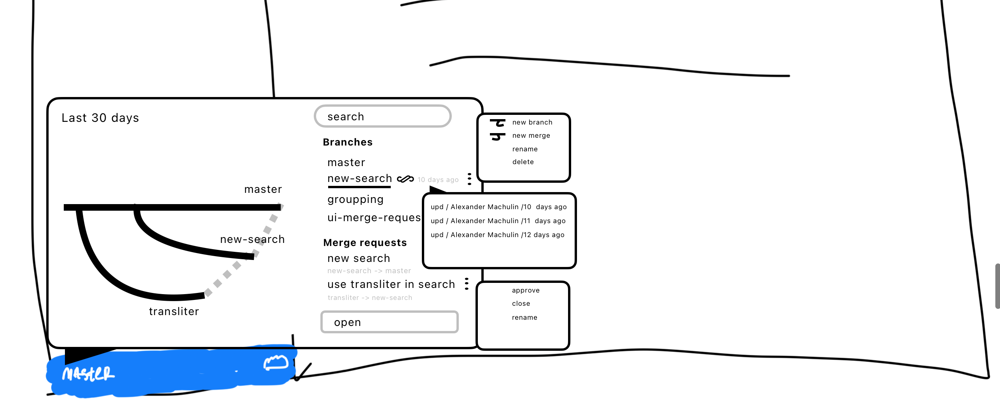

[cut:Оригинальный запрос от X5:true]

Реализовать Workflow по согласованию «Справочной информации для пользователя», которое будет включать в себя как минимум следующие этапы:

-  Назначение согласующих

-  Получение Обратной связи

-  Подтверждение от согласующего о согласовании или не согласовании.

-  Детали Workflow определяются на этапе реализации

-  Допускается разделение статусной модели и Workflow по согласованию.

Неформально они согласились на следующее:

1. Технический писатель указывает почты проверяющих.

2. Проверяющим приходит на почту письмо, что надо проверить.

3. Проверяющий вычитывает и ставит условный «лайк».

4. Лайк записывается в хранилище с указанием почты лайкнувшего, даты, статьи.

5. На статье суммируются все лайки от всех, кто их ставил.

[/cut]

1. Когда нажимаем на название ветки в синей панели, то появляется всплывающее окно.

2. Во всплывающем окне видим:

   -  Граф по веткам.

   -  Список веток и мержреквестов

Пользователь может просматривать связи веток и переходить в сами ветки и мержреквесты, чтобы проводить редактирование и ревью.

