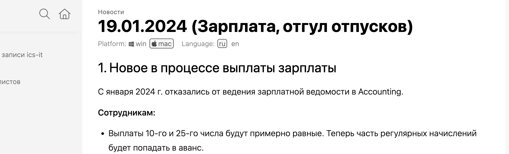

:::note Чего пока нет

-  Пока предлагаю одно измерение сделать, например Страна. Потом по такому же принципу можно будет еще измерений добавить. В Figma, например, при добавлении второго измерения, первый переименовывается в Mode 1, а второй в Mode 2. И потом можно их переименовать.

-  Также сделать пока на уровне статей. Потом по такому же принципу добавим это для отдельных разделов, вместе с фрагментами.

:::

### Основной сценарий

Редактор создает новый вариант статьи чтобы можно было выбирать только интересующий вариант:

-  **Создание варианта статьи**. В тулбаре статьи видит опцию [icon:square-sliders] с тултипом  *Варианты.* Нажимает ее и видит выпадающий список всех вариантов с заголовком *Укажите вариант для текущего контента*. Т.к. нет ни одного варианта он видит *(нет вариантов)*. Снизу есть кнопка + *Добавить вариант*.

-  **Добавление варианта в справочник**. После нажатия на *Добавить* открывается модальное окно добавления варианта, где указывает: 1) id варианта = "mac” 2) название = MacOS 3) иконка (или emoji?) = apple. Нажимает *Добавить*. 

-  !!Указать что во всем каталоге общий справочник

-  **Полоска вариантов в заголовке**. В текущей статье снизу заголовка появляется полоска с названием и конкой добавленного варианта. Этот вариант активен.

-  **Всплывающий плюсик**. При наведении на полоску вариантов справа от них появляется кнопка + с тултипом *Добавить вариант* появляется тот же список вариантов. Добавляет еще один вариант.

   ???Есть еще вариант чтобы при попытке активировать вариант добавлялись сразу все варианты, но все пустые варианты будут серыми, это значит что там нет контента.

   

   При наведении на плашку варианта, сбоку появляется троеточие, в меню есть пункт Удалить (либо можно отображать тулбар).

-  модальное окно с полями: Вариант текущего содержимого. Добавить еще один вариант выпадающий список с заголовком Выберите текущий вариант Добавить варианты, укажите текущий вариант и список вариков. А снизу пункт - добавить новый. При нажатии на него открывается отдельное

-  Окно добавления варианта с полями 1) иконка или эмодзи? 2) название 3) # (будет добавляться как постфикс). 4) чекбокс - по умолчанию, если префикса нет, то автоматически считаем что это вариант для этой платформы и тогда в списке валиков он показывается как варик по умолчанию. Как сменить варик по умолчанию?

При просмотре отображается как обычный фрагмент, но под заголовком есть кнопки-переключатели

при вставке не показывается выбор варианта под заголовком, если в статье уже был до этого выбранный вариант. Но при переходе в статью будет виден выбор варианта.

Переключение между вариантами работает в докпортале тоже.

-  редактировать вариант можно только в мастер-фрагменте, при вставке можно только просматривать

Вариант по умолчанию?

### Требования

-  **Вставка работает как для обычных фрагментов**. При вставке фрагмента с вариантами работает все как с обычными фрагментами, но под заголовком вставленного фрагмента появляется полоска с вариантами. В markdown все как для обычных фрагментов.

-  **Имена файлов с постфиксом**. Файл статьи с вариантом именуется с постфиксом с id варианта. Например `_mac`.

-  **Варианты по умолчанию**. Должен быть хотя бы один вариант по умолчанию. Для такого варианта для файла не добавляется постфикс.  Этот вариант может идти в справочнике вариантов первым Для таких вариантов

-  id вариантов должен быть уникальным

-  **\-Именование файлов**. Вариант статьи. Вста(значения параметров должны быть уникальными на уровне каталогов). Добавляются через подчеркивание к названию файла статьи

## Что изменить

-  В параметры добавлять выбранное измерение

-  Отрисовать табы

-  Показать как их удалять и добавлять

-  

## Открытые вопросы

-  Где хранятся варианты - в doc-root

-  **Включать ли заголовок в тело варианта?** Видимо надо включать, например для языков есть параметр языка Русский и название заголовка “Как доставить товар”, а для английского фрагмента нужно задать английское название

-  **Как удалить вариант и как добавить новый?** Когда показалась строка с вариантами то при наведении на параметр после списка значений через позишн абсолют добавляется троеточие. При наведении на значение параметра тоже отображается троеточие. СЛОЖНО, пока проще

-  **\-Как локализуются названия вариантов?** На русском это платформа, а на английском platform. Видимо одни параметры должны быть главнее чем другие, т.е. чтобы иерархия была.

-  **Локализация как варианты**. Язык - такой же вариант как остальные, предлагаю не делать отдельной настройкой, по идее должно быть элегантенее, что один механизм покрывает все случаи, а не сделано отдельными фичами.

   Но надо ведь навигацию фильтровать по выбранному языку. Т.к. нет смысла просматривать

-  **Вариант по умолчанию**. Если включен, то выпадающее окно с   Является значением по умолчанию - значит можно не указывать его и постфикс для статьи не будет. Например для каталога язык русский для всех статей по умолчанию

-  **Сохранение выбранного варианта**. Когда читатель выбирает вариант платформы mac, то выбор параметра сохраняется и контент, который имеет вариант под платформу mac - автоматически переключается. (это также работает на докпортале для читателей)

-  **Справочник вариантов не сортируется?** Т.к. скорее всего нужна ручная сортировка.

### В будущем

-  Для описания вариантов для фрагмента предлагаю в маркдауне обернуть только родительский заголовок в блок фрагмента. Все заголовки другого уровня считать вариантами. А как указывать этот вариант?

-  Добавить троеточие в заголовок статьи

### Идеи на будущее (далекое)

-  Можно в каталог сделать специальную директорию для JavaScript-кода, который будет автоматически использоваться в [gram.ax](http://gram.ax) для этого каталога.

-  Сделать использование фрагментов параметризованным, чтобы можно было параметры вставлять по телу статьи