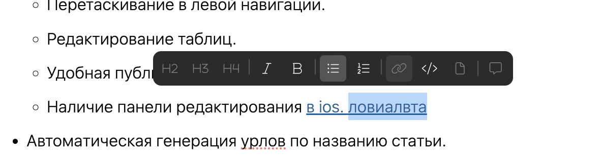
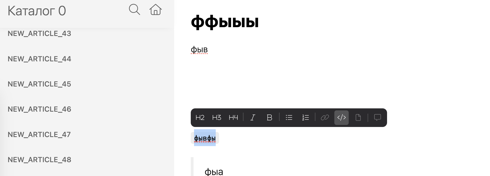

Проблема залучается в том что у нас нет концепции логики взаимодействия инлайновых элементов. Хотелось бы ее иметь.

**Основные критерии приемки:**

-  Иналайновые элементы типа `с переключателем` можно переключать

-  Иналайновые элементы типа `без переключателя` нельзя переключать

**Критерии приемки:**

-  Иналайновые элементы типа `с переключателем` можно переключать с помощью хоткея или кнопки в панелях

   -  Если курсор находиться в инлайновом элементе типа `с переключателем`

      -  кнопка инлайнового элемента находиться в активном состоянии

         -  при нажатии на кнопку можно начать писать текст без оформления инлайнового элемента

   -  Если выделил часть или весь инлайновый элемент типа `с переключателем`

      -  кнопка инлайнового элемента находиться в активном состоянии

         -  при нажатии на кнопку выделенная часть очищает оформление инлайнового элемента и можно начать писать текст без оформления инлайнового элемента

-  Иналайновые элементы типа `без переключателя` нельзя переключать никак переключать, можно только удалить

   -  Если курсор находиться в инлайновом элементе типа `без переключателем`

      -  кнопка инлайнового элемента находиться в состоянии активный без доступа

   -  Если выделил часть или весь инлайновый элемент типа `без переключателем`

      -  кнопка инлайнового элемента находиться в состоянии активный без доступа

Исходные заявки:

-  <https://support.ics-it.ru/issue/GXS-1397>

   -  Проблема: после того, как убрали кнопку очистки форматирования, стало сложно укоротить текст ссылки (см. Пример 1).

      Решение: добавить возможность  обрезать ссылку, если она есть в выделении, иначе добавить ссылку. Работать это будет на кнопку ссылки, в инлайновой панели.

\[ \] Можно снять выделение с части ссылки;

\[ \] Можно удалить ссылку с помощью инлайновой панели.

-  <https://support.ics-it.ru/issue/GXS-1439>

   -  Проблема: при выделении строки кода, в инлайновой панели, курсив и жирный не заблокирован в интерфейсе (см. Пример 2), если на них нажать, ничего не происходит.

      Решение: при выделении строки кода, блокировать инлайновое форматирование в интерфейсе.

\[ \] При выделении строки кода, инлайновое форматирование заблокировано.