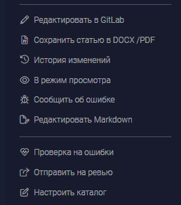

У нас нет атома кнопки с иконкой, хочется такую добавить, чтобы не было копипаста.

Критерии:

-  Кнопка “Удалить каталог” какая-то серая и маленькая. Можем сделать кнопкой с типом link со стандартным видом?

   

-  все кнопки с иконками использую атом <Button  type=«link» icon=«text»  />

Все кнопки, кроме экспорта - используют 1 компонент.

**11\.01 Затраченное время: 1 час.**

**12\.01 Затраченное время: 3 часа.**

**15\.11 Затраченное время: ? часов.**

**16\.11 Затраченное время: 8 часов.**

**17\.11 Затраченное время: 7 часов.**

**18\.11 Затраченное время: 4 часа.**

#### Сделано:

**Отрефакторино 2 атома**:

-  Кнопка:

   1. Были настроены стили разных тем;

   2. Легкое добавление новых тем;

   3. прозрачная логика работы кнопки и ее пропсов.

-  Иконка:

   1. реструктуризирована логика по возвращению lodaer и svgIcon;

   2. Переработан механизм добавления стилей к иконке, теперь он стал прозрачным.

#### Добавлен концепт молекул:

**молекула** - компонент, который состоит из атомов, может использоваться в любой части приложения.

Новая молекула - **ButtonLink**:

-  **ButtonLink** содержит в себе атомарную кнопку и иконку, использует хук useLocalize для контента и всегда имеет стиль transparent.

Атом кнопки и новая Молекула были добавлены в **storybook**.

<https://gitlab.ics-it.ru/ics/doc-reader/-/merge_requests/448>