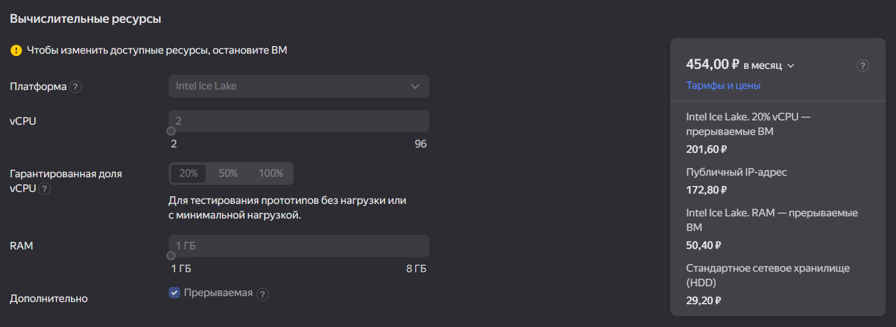
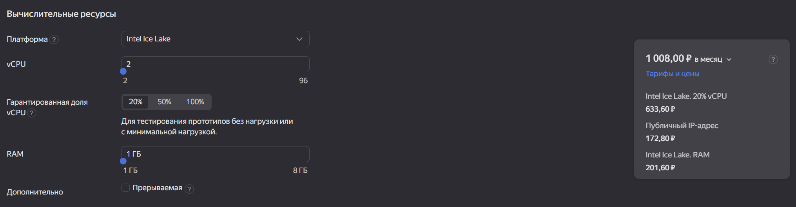
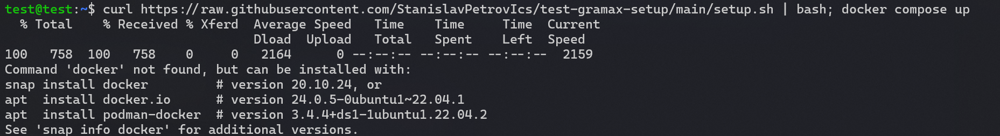
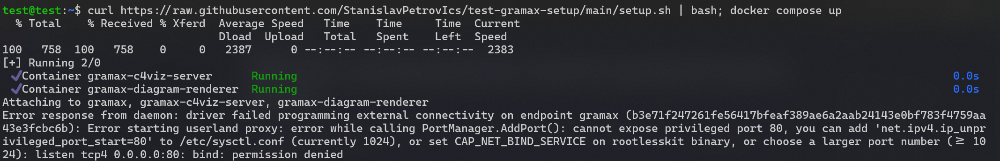
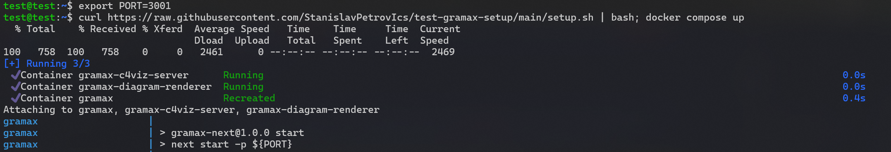
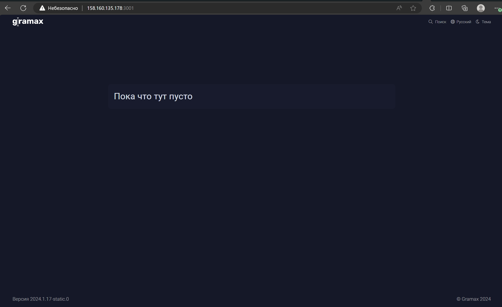
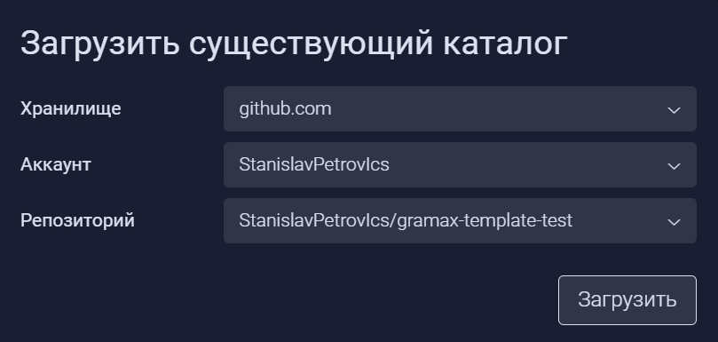
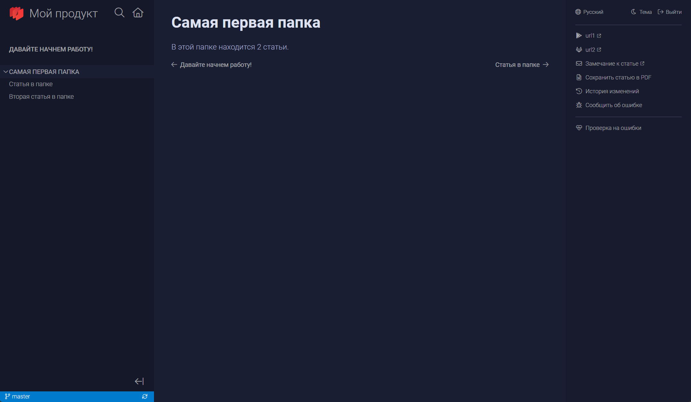

Необходимо протестить кейс: я, как сторонний пользователь, хочу опубликовать свой докпортал в яндекс облаке.

#### Вводные:

1. 1 любой реп в гитхабе.

2. Тестовое Яндекс Облако.

#### Все тесты проводились на машине с конфигурацией:

Процессор - 2 виртуальных ядра

ОЗУ - 1 гб

[cut::false]

(Я использовал прерываемую машину вместо нормальной, потому что мне размера гранта не хватило арендовать непрерываемую, из минусов ее может прервать яндекс в час пик и нужно перезапускать как минимум раз в 24 часа)

[/cut]

#### Мои шаги:

1. Пытаюсь сразу запихнуть команду для запуска грамакса в полностью голую машину. Но на машине нет докера, система сама предлагает команды для установки докера.

   

2. Использую любую из предложенных системой команд (кроме `snap`'а, т.к для `docker`'а с `snap`’ом нужно долго и сильно мучаться, но если пользователь уже устанавливал докер, то скорее всего никаких проблем не будет).

3. Запускаю еще раз и он отказывается запускаться на 80 порту, т.к он является привилегированным (в убунте все порты ниже 1024 являются привилегированными и для них нужны особые права).

   

4. Добавляю порт (`export PORT=3001`) в переменные среды и все работает.

   

5. Перехожу по `ip_машины:порт` и все работает

   

6. Добавляю гитхаб как хранилище

   

7. Клоню тестовый каталог

   

8. Ждем окончания клона

   

#### Использование ресурсов:

-  1 инстанс:

   -  немного процессора

   -  ≈300мб ОЗУ с 3 каталогами (вместе с системой ≈600мб)

-  3 инстанса:

   -  столько же сколько и 1 инстанс

   -  ≈650мб ОЗУ с 3 каталогами (вместе с системой ≈1гб)

## Инструкция

### Создание виртуальной машины в Yandex Cloud

1. [Создайте Яндекс Облако](https://cloud.yandex.ru/ru/docs/getting-started/individuals/registration) или войдите в существующее.

2. Создайте ресурс *Виртуальная машина*.

3. Настройки операционной системы, дисков, вычислительных ресурсов можно оставить без изменений. Или [скорректировать на свое усмотрение](https://cloud.yandex.ru/ru/docs/compute/quickstart/quick-create-linux).

4. В блоке *Доступ* задайте любое имя и сгенерируйте SSH-ключ [по инструкции](https://cloud.yandex.ru/ru/docs/compute/operations/vm-connect/ssh#creating-ssh-keys).

5. Нажмите *Создать ВМ*.

### Установка docker на виртуальную машину

1. Откройте созданную ВМ и в блоке *Сеть* скопируйте публичный iPv4.

2. Откройте консоль на компьютере и введите команду `ssh {имя из настроек доступа ВМ}@{скопированный iPv4} -i {путь до SSH-ключа}`. Например -- `ssh admin@158.160.128.224 -i C:\Users\name\.ssh\yandexcloud`.

3. Установите `docker` и `docker compose` командой `sudo apt install docker.io docker-compose-v2`.

4. (Опционально) Добавьте докеру поддержку rootless режима, по инструкции [Run the Docker daemon as a non-root user (Rootless mode) | Docker Docs](https://docs.docker.com/engine/security/rootless/), чтобы не нужно было использовать `sudo`в командах докера

### Установка портала для чтения Gramax

1. Разверните Gramax в установленном docker [по инструкции](https://gram.ax/resources/docs/quick-start).

2. Откройте портал по пути `http://{iPv4}:{PORT}/admin` (например -- `http://158.160.128.224:1025/admin`) и введите логи и пароль из настроек переменных среды.

3. Подключите хранилище и загрузите каталоги для чтения. Они будут доступны по ссылке `http://{iPv4}:{PORT}/` (например -- `http://158.160.128.224:1025/`).