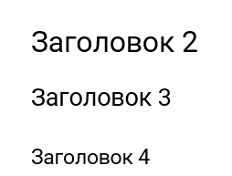
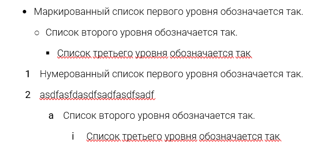
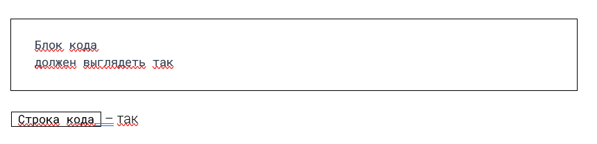
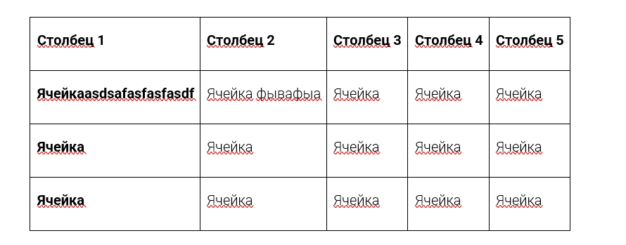
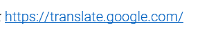

Сейчас документ в docx экспортируется со стилями по умолчанию. Хочется, чтобы экспортируемый документ в docx был максимально похож на экспортируемый файл pdf.

Критерии:

-  **Весь документ** имеет поля размеров: `top: 1`см, `bottom: 1.85`см, `left: 1.85`см, `right: 1.85`см.

-  Обычный текст документа имеет **шрифт** - `Roboto Light`, **размер** `12`пт, **отступ -** `0.0`см встроенной линейки, **межстрочный интервал** равный `1.5`, **интервалы перед равен** `0`пт **и после** равен `8`пт.

-  **Названия статей и каталога**, *в не зависимости от вложенности*, имеют шрифт `Roboto` размером `24.5`пт.

-  Статьи  *в загаловке* выделяются как заголовок того уровня, в каком уровне он вложенности.

-  Абзацы `H2`, `H3`, `H4` имеют шрифт `Roboto`, и размер `19`, `16`, `13.5`пт. соответственно.

   

-  Шрифты: **жирный текст** - `Roboto Bold`;курсивный текст - `Roboto Light Italic`; строка кода и блок кода - `Roboto Mono`, размером `10`пт.

-  Маркированный список имеет: **левый** **отступ -** `0.12`см, с увеличением на `0.5`см при каждом новом уровне вложенности.  **Межстрочный интервал** равный `1.75`, **интервалы перед равен  и после** равны `0`пт, **выступ** - `0.5`см.

-  Нумерованный список имеет: **левый** **отступ -** `0`см, с увеличением на 1см при каждом новом уровне вложенности.  **Межстрочный интервал** равный `1.75`, **интервалы перед равен  и после** равны `0`пт, **выступ** - `0.5`см.

-  **Строка кода** должна иметь рамки темного цвета, а цвет.

-  Шрифт **блока кода** имеет цвет `#323E4F`. Выделяется рамками по всей странице

-  Строки в таблице имеют отступы: перед- `12`пт, после - `6`пт, междустрочный - `1.5`см.

-  С таблицами пока сложно <https://github.com/dolanmiu/docx/issues/216>

-  Пример ссылок:

-  фывафыав