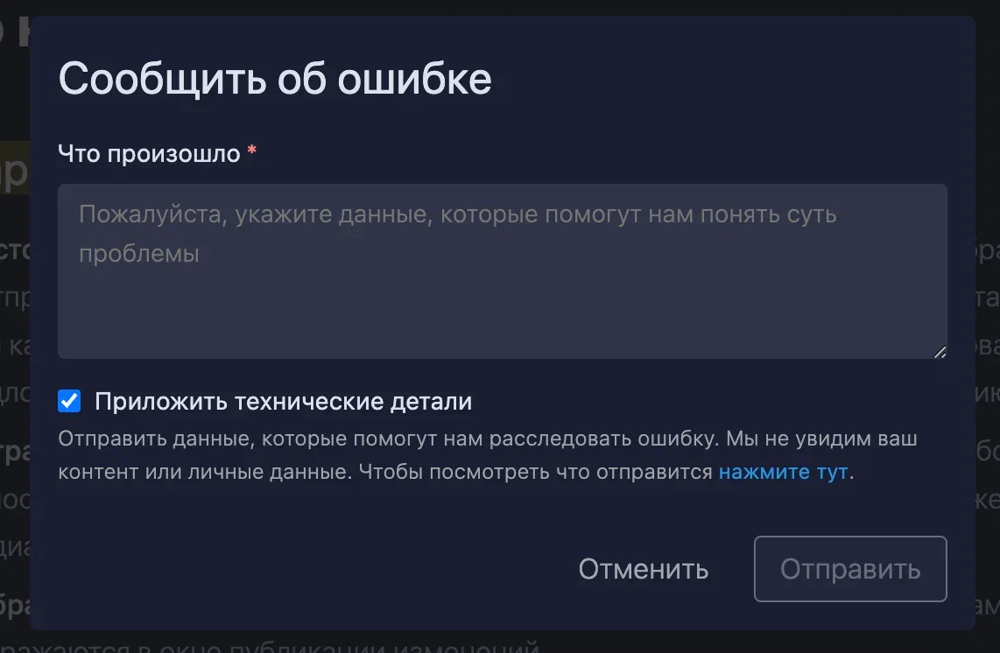

Сейчас кнопка сообщить об ошибке просто перекидывает на чат в телеграмме. Мы хотим добавить функционал, позволяющий пользователям отправлять логи, с помощью которых мы могли бы решать проблемы.

Критерии:

-  \[x\] При нажатии на кнопку «Сообщить об ошибке» открывается модалка с заголовком «Сообщить об ошибке» состоящей из:

   -  \[x\] Поля «Комментарий», который содержит textarea с текстом внутри: «Укажите детали, которые помогут нам понять суть ошибки».

   -  \[x\] Описания “Мы не увидим ваш контент или личные данные”.

   -  \[x\] Кнопок «Отменить» и «Сообщить»

Формат данных отправляемых в багснег:

-  \[x\] Структура статьи без его контента

-  \[x\] Логи последних команд гита

-  \[x\] Настройки самого приложения

-  \[x\] Версия приложения

Сделай так

**Срок**: 1д