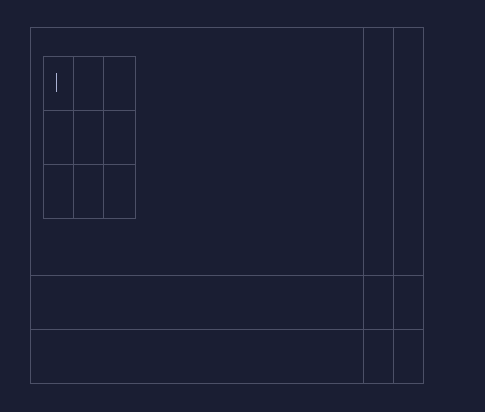

Сейчас все блоки можно во все блоки вставлять, что является не очень хорошей практикой как выяснилось. Хотелось бы сделать какие-то ограничения, чтобы визуальный редактор работал более логично.

**Основные критерии приемки:**

-  В блоки типа `С контентом` и `Списки` можно вставлять все остальные типы блоков, кроме блоков типа `С контентом`;

-  В остальные типы блоков нельзя вставлять никакие блоки.

**Критерии приемки:**

-  Если курсор находиться в блоке типа `С контентом` то создание блоков типа

   `С контентом` и `Заголовок` будут не доступны;

   -  все кнопки  блоков типа `С контентом` и `Заголовок` не будут доступны, кроме:

      -  кнопка блока, в котором находится фокус. По повторному клику оформление снимается, текст превращается в параграф. Не распространяется на кнопку таблицы -- она также не будут доступна, таблицу можно только удалить.

-  Если курсор находится в блоке типа `Список` то все кнопки и все хоткеи создания блоков типа

   `С контентом` и  `Заголовок` будут недоступны;

   -  все кнопки  блоков типа `С контентом` и `Заголовок` не будут доступны.

-  Старые статьи отображаются как раньше.

Исходные заявки:

-  https://support.ics-it.ru/issue/GXS-1418

-  https://support.ics-it.ru/issue/GXS-1432

-  https://support.ics-it.ru/issue/GXS-1438

Пример проблемы: когда в ячейку таблицы (см. Пример 2), вложена еще одна таблица, тогда, во вложенное таблице, нельзя размещать контент, иначе родительская и вложенная таблица пропадут.

Это ограничение редакторов. В Notion и Paper в ячейку  таблицы нельзя поместить таблицу.

Решение: ограничить возможность добавления таблицы, в ячейку таблицы.

