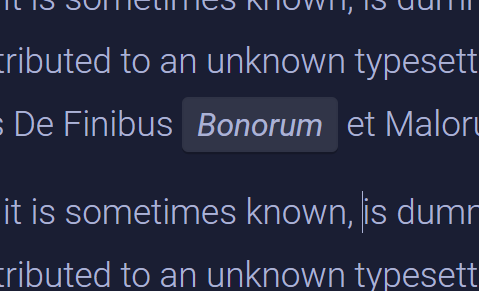
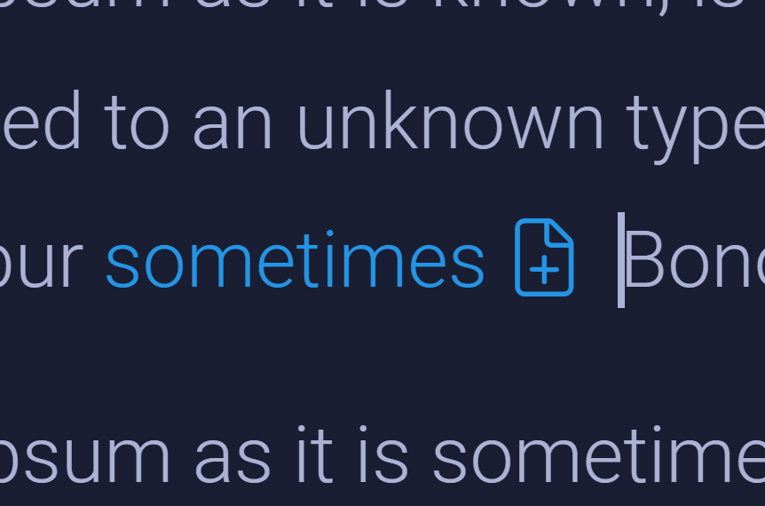
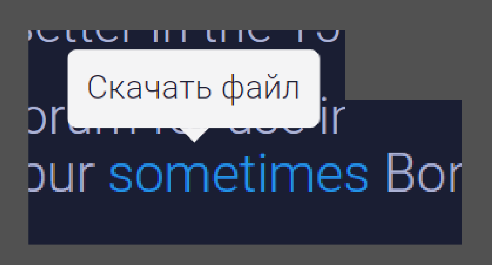
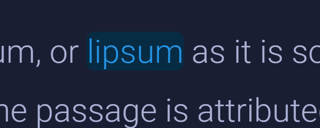
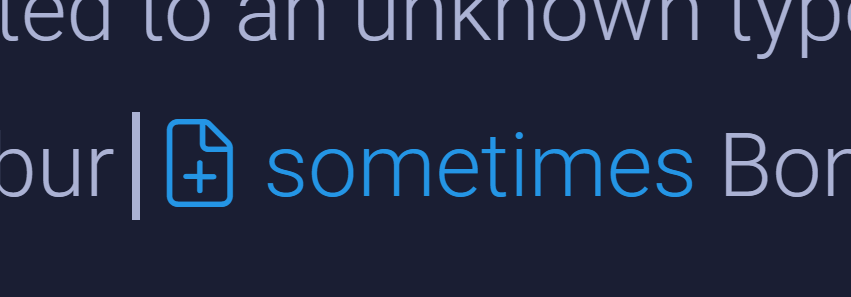

### Текущие проблемы в маркерах:

||||
|-|-|-|
||||
||||

**Ссылка**:

1. не могу переместить курсор, что бы быть в ссылке и перед первой буквой;

2. за последней буквой маркера остается форматирование;

3. когда курсор в ссылке, всегда появляется тултип и переключает фокус.

**Строка** кода:

1. не могу установить курсор перед первой буквой;

2. если выйти при помощи пробела, пробел станет - character `U+00a0`

**Жирный** шрифт:

1. не могу установить курсор, что бы быть в жирном и перед первой буквой.

2. не меняется состояние активного маркера, когда курсор находится за последней буквой маркера

**Курсив**:

1. не могу установить курсор, что бы быть в *курсиве* и перед первой буквой.

2. не меняется состояние активного маркера, когда курсор находится за последней буквой маркера

**Комментарий**:

1. не могу переместить курсор, что бы быть в ссылке и перед первой буквой;

2. не могу установить курсор за последней буквой маркера.

3. когда фокус в комментарии, по нажатию на ESC курсор перемещается влево на один символ.

### Общая логика:

1. можно установить курсор перед маркером, для написания обычного шрифта;

2. изменяется цвет каретки в маркере;

3. в последнем символе маркера можно поставить курсор и писать с этим маркером;

4. после выхода из маркера обновляется состояние на панели редактирования.

5. после последнего символа маркера - курсор не меняет положения с возможностью продолжить писать текст без маркера.

### Общие проблемы:

-  баг на панели, не меняется стейт, после выхода по стрелочке.

### Замечания:

**Ссылка, файл, коммент**:

-  Отличие: выход без второго нажатия стрелки

**Строка кода**:

Отличие строки кода от курсива и жирного шрифта заключается в стилях, но теперь нужно будет реализовать новую логику:

1. возможность  поставить курсор:

   1. перед строкой кода

   2. перед первой буквой и быть в строке кода

   3. после последней буквы и остаться в строке кода

   4. после строки кода.

В модификации нуждается инлайновый файл:

1. возможность поставить курсор:

   1. перед картинкой файла

   2. перед первой буквой

## **Стабилизация инлайновых маркеров в статье**

**Проблема**:

-  Файл в статье и инлайновый код работают не очевидно с текущим интерфейсом:

   -  Большой padding в строке кода по краям, который создает пространство в статье, куда нельзя установить курсор;

   -  Иконка файла перед ссылкой, которая создает пространство в статье, куда нельзя установить курсор.

**Референсы**:

-  Word;

-  Paper;

-  Notion.

**Отличие от референсов**: по двойному нажатию на пробел, активный маркер очищаются. Перед выходом из маркера (жирного, курсива, строки кода), нужно еще раз нажат стрелочку.

**Обнаружено**: поведение инлайновых маркеров в Gramax одинаковое в сравнении с референсами.

**Варианты решения для файла**:

Как отдельный элемент в статье:

---

Переместить иконку в право:

---

Убрать иконку, добавить тултип:

---

Добавить фон для файлов как у комментария, убрать иконку:

---

Ничего не трогать.

---

Вариант решения для строки кода:

-  Внутренний отступ строки кода установить как у комментария.

**Баг**: когда в тексте курсив и жирный, тогда по нажатию 2-х пробелов, очистится один из инлайновых маркеров, по третьему нажатию пробела очиститься второй инлайновый маркер.