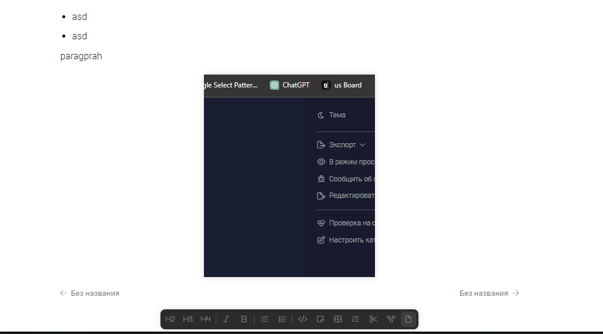

Блок без текста - блок или состояние блока в который нельзя поставить писать текст.

**Проблема**: Когда в конце статьи блок - `без текста`, тогда пользователю не очевидно, как продолжить статью ( Рисунок 1.1 ).

**Критерии**: Добавить пространство в статье, по нажатию на которое, в конце статьи, будет добавляться пустой параграф (если его там нет) и устанавливаться фокус в него.