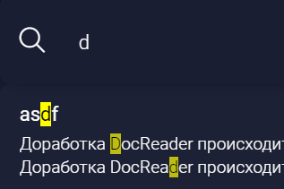
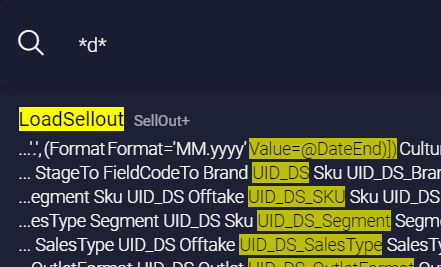

Новый поиск должен решить следующие проблемы:

-  вынужденное написание “\*” для поиска по части слова

-  невозможность искать через транслитерацию

-  неправильную раскладку клавиатуры.

#### Критерии

-  \[x\] Не нужно писать `“*”`, чтобы искать по части слова.

-  \[x\] Возможность искать через транслитерацию и неправильную раскладку клавиатуры.

-  \[x\] Если нужно искать по точным совпадениям, можно использовать кавычки, например `“слово два"`. В таком случае фраза ищется с точным поиском, а значит  будут выданы фразы только равные искомой.

-  \[x\] Можно исключать слова или фразы из поиска. Например `-слово` или `-"какая-то фраза"`.

-  \[x\] Поисковик работает с неточным поиском в начале или конце слова, например при слове `жобавления`, поиск будет удачным. Если ошибка в середине слова, поиск может сработать хуже, чем если она будет в конце или начале слова.

-  \[x\] Раньше выделялось слово целиком, при поиске по части слова, теперь выделяется только искомая часть слова.

   

   

#### Design details:

-  Новый поисковик реализует интерфейс `Searcher`.

-  Поиск через транслитерацию и неправильную раскладку клавиатуры -  метод в отдельном файле, который принимает только один параметр: `query`.

-  Класс поисковика содержит только три публичных метода: `search`, `searchAll`, `resetAllCatalogs`.

-  Конструктор класса поисковика принимает только один параметр типа `IndexDataProvider`, а сам класс содержит приватное поле такого же типа.

-  Конструктор класса “IndexCacheProvider” принимает параметры типа `Library`,  `MarkdownParser`, `ParserContextFactory`, `IndexCacheProvider`, а сам класс содержит приватные поля таких же типов.

-  Код отрефакторен таким образом, что вся логика, не связанная с поиском и связанная с `Library`,  `MarkdownParser`, `ParserContextFactory`, `IndexCacheProvider`, перенесена в класс `IndexDataProvider`.