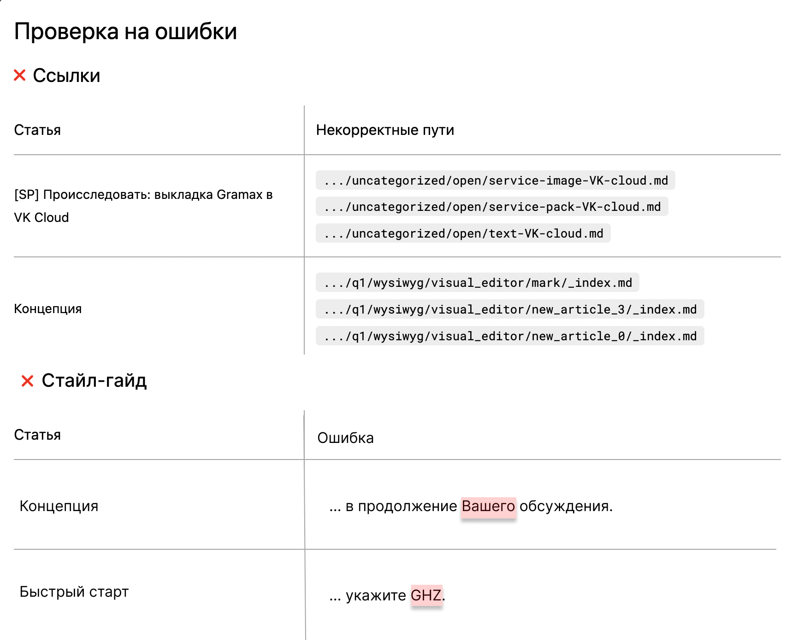
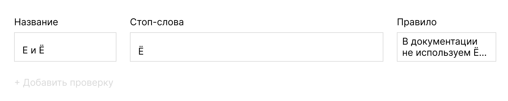
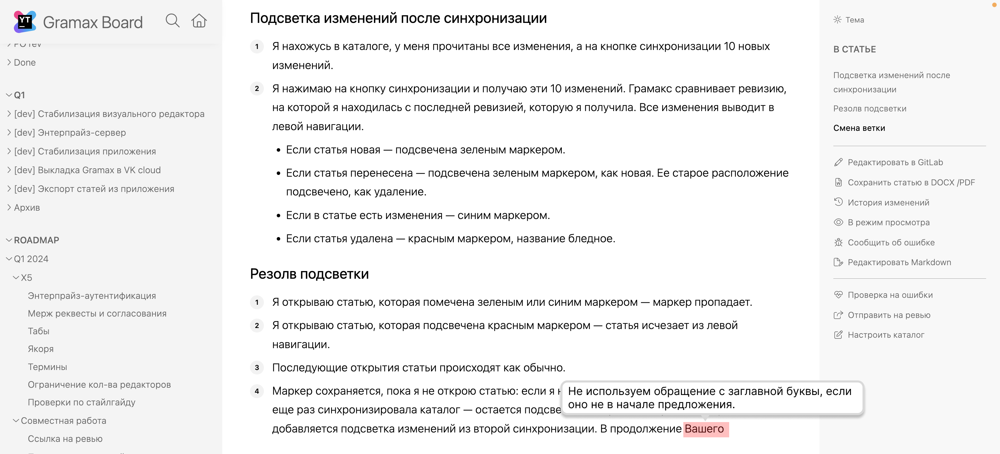

-  Подсветку в статье сделать сложно -- нужен механизм, который понимает какому символу markdown какой символ в отображаемом документе соответствует. Этот же механизм нужен для подсветки изменений в статьях. Этим можно заняться следующим этапом.

**Верхнеуровневые бизнес-требования**: В стайлгайде компании есть список стоп-слов. Нужно проверять текст на их наличие и, если они найдены, то давать пояснения на что их стоит заменить.

Кто удалось исследовать и как можно сделать

-  В расширении LanguageTool extension можно настроить свой сервер и проверки будут по своему словарю и своим правилам

-  Еще можно сделать чтобы он в статье показывал счетчик ошибок, которые найдены в тексте текущей статьи, но это будет неудобно.

Я хочу иметь возможность настраивать проверки, чтобы стоп-слова из стайлгайда автоматически подсвечивались в статьях.

Требования:

1. Возможность настраивать неограниченное кол-во проверок.

2. Для каждой проверки должна быть возможность указать:

   1. Стоп-слова.

   2. Правило, почему их не стоит использовать и на что заменить.

3. Можно запустить проверку по всем каталога.

## Запуск проверки

1. При нажатии на публикацию - сверху будет область, которая проверяет на ошибки. Модальное окно которое проверяет все на ошибки (главное чтобы это было не очень долго).

2. В правой панели нажимаю “Проверить на ошибки”.

3. Просматриваю ошибки в блоке “Стайл-гайд”.

   

Администрирование проверок в каталоге или стайлгайде?

-  Чтобы работала морфология (склонения) в стоп-словах, нужно подключить что-то более серьезное чем простая проверка орфографии по словарю.

-  Чтобы мы могли проверять наличие грамматических вещей типа страдательного залога, нужно что-то сложное типа LanguageTool или подобных инструментов.

## Дальнейшие шаги

### Интерфейс администрирования проверок

1. Захожу в интерфейс создания проверки (где?).

2. Задаю название проверки, стоп-слова и пралвило.

3. Сохраняю проверку.

### Отображение ошибок в статье

1. Проверка найдет и подсветит стоп-слова. При наведении на них появится тултип с правилом и примерами замены

2. Кликаю на название статьи и перехожу в нее -- меня сразу докручивает до проблемного слова, оно подсвечено.

3. Я навожу на слово курсор, сверху в тултипе выводится правило.

   

4. Стираю слово и подсветка пропадает. Также слово пропадает из окна проверки на ошибки.