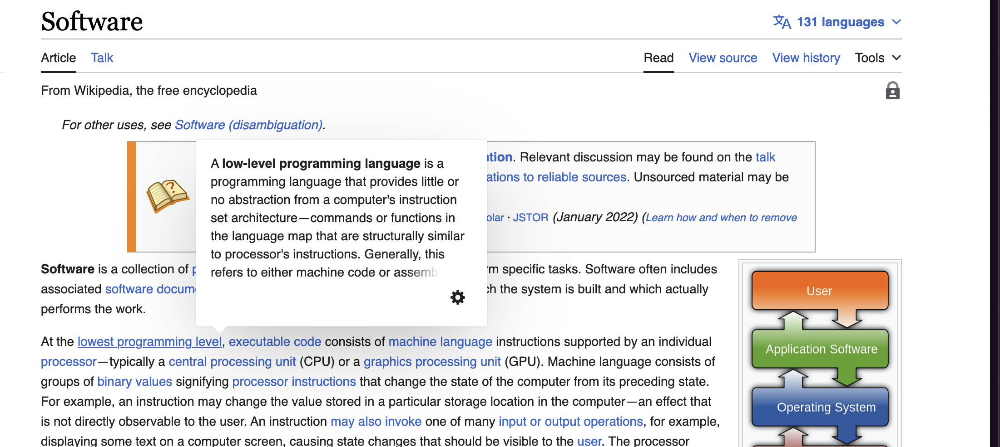

Как таковые термины предлагаю не делать, ограничиться ссылками на статьи и превью контента статьи, как в Википедии.

В дальнейшем, если мы сделаем типизацию блоков и возможность делать на них ссылки, то можно будет делать отдельную статью с глоссарием и делать ссылки на блоки в этой статье с превью текста блока.

1. [comment:2]Когда навожусь на ссылку[/comment], которая ведёт на статью в каталоге, то над окном редактирования ссылки [comment:1]появляется превью статьи[/comment].

2. Превью показывает:

   1. Первый блок в статье, который является текстом.

   2. Если после текста идёт список, то его также показываем в превью.

   3. Превью не должно превышать 290 символов. После 285 символа предлагаю осветлять текст, чтобы юзер понял, что можно прочитать продолжение по ссылке.

3. Текст в превью сохраняет форматирование из статьи. В т.ч., если там есть ссылка или файл, то из превью можно их считать/перейти, но нельзя редактировать.

4. Текст в превью можно выделить и скопировать.