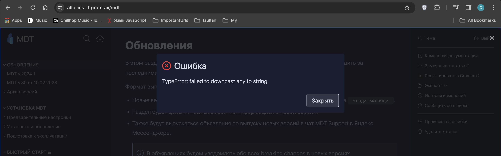

#### Проблема

Так как мы сейчас в докпортале используем **isomorphic git**, то при клоне/смене ветки/пулле происходят большие скачки потребления ОЗУ/процессора и иногда из-за этого нода умирает по ООМ(out of memory). Поэтому необходимо перейти на нативный гит, чтобы уменьшить потребление ресурсов и ускорить работу приложения.

#### Критерии приемки

-  \[ \] Докпортал использует libgit2 вместо изоморфика для git’овских операций

-  \[ \] Докпортал перестанет падать

-  \[ \]

#### Трудоемкость

2 дня

#### Детали реализация

-  Написать биндинги на js

-  Немного изменить cargo.toml

[comment:1]Замечания[/comment]

При переключении ветки

Также при синхронизации 

